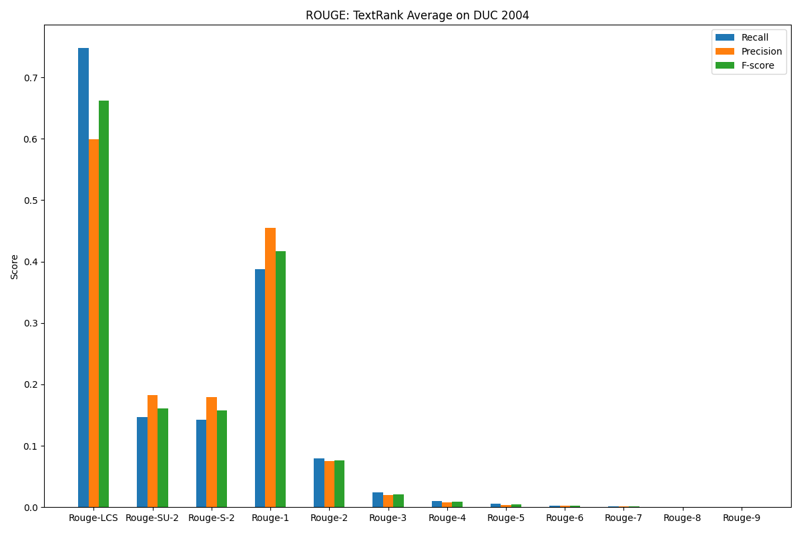

# Keyphrase Extractiton

This repository focuses on implementing the TextRank algorithm
as specified in *TextRank: Bringing Order into Text* by
Rada Mihalcea and Paul Tarau. The paper can be found
[here](https://web.eecs.umich.edu/~mihalcea/papers/mihalcea.emnlp04.pdf).

## Sample `python kw.py`
```
$ python kw.py
Filtering sample...
Generating graph...
Processing...
Reached conversion after 41 iterations.
Top keywords in sample 1:
1. set
2. systems
3. minimal
4. linear
5. solutions
6. algorithms
7. inequations
8. types
9. strict
10. Criteria
11. Diophantine
12. system
13. compatibility
14. equations
15. numbers
16. Upper
17. natural
18. components
19. constraints
20. criteria
21. corresponding
22. sets
23. construction
24. supporting
25. nonstrict
Collapsed keywords in sample 1:
1. linear constraints
2. natural numbers
3. linear Diophantine equations
4. strict inequations
5. nonstrict inequations
6. minimal set
7. corresponding algorithms
8. minimal supporting set
9. types systems
10. mixed types
```

## Sample `python ks.py`
```
$ python ks.py
Sanitizing sample...
Generating graph...
Processing...
Reached conversion after 41 iterations.
Summary for sample 0:
The National Hurricaine Center in Miami reported its position at 2 a.m. Sunday at latitude 16.1 north, longitude 67.5 west, about 140 miles south of Ponce, Puerto Rico, and 200 miles southeast of Santo Domingo. Hurricaine Gilbert Swept towrd the Dominican Republic Sunday, and the Civil Defense alerted its heavily populated south coast to prepare for high winds, heavy rains, and high seas. The National Weather Service in San Juan, Puerto Rico, said Gilbert was moving westard at 15 mph with a "broad area of cloudiness and heavy weather" rotating around the center of the storm. Strong winds associated with the Gilbert brought coastal flooding, strong southeast winds, and up to 12 feet to Puerto Rico’s south coast. San Juan, on the north coast, had heavy rains and gusts Saturday, but they subsided during the night. 
```

# Notes

Our results differ from the original paper most likely due
to minor details regarding how the original text abstracts
were preprocessed. 

For keyword extraction, we used `nltk` as our preferred
part of speech tagger and stopword repository. The
original paper may very well have had used different
algorithms for tagging and stopword removal which led
us to have slightly different, albeit mostly consistent
result *on our sample*.

We are currently working on evaluating the model to
ensure that our performance reflects the reference
implementation in the paper.

# Naive Evaluation

We evaluated the performance of TextRank using the ROUGE evaluation 
package implemented in [udax](https://github.com/pvcpc-aig/udax). The
TextRank implementation used is located in the `textrank.py` module of
this repository (NOT `pagerank.py`). One noteable modification to
ROUGE-LCS is made in `udax` which is documented in the project's
README. The task consisted of summarizing batches of related documents
and creating a single summary of roughly 100 words. The system summary
was then compared against 4 reference summaries.

The method by which we computed the summary was very simple and could
most certainly be improved. No filters were used on the text,
meaning that no stopwords were removed, and all parts of speech were
considered. 

Evaluation Method | Recall | Precision | F-Score
----------------- | ------ | --------- | -------
Rouge-LCS         | 0.748  | 0.599     | 0.662
Rouge-SU-2        | 0.147  | 0.183     | 0.161
Rouge-S-2         | 0.142  | 0.179     | 0.157
Rouge-1           | 0.387  | 0.455     | 0.417
Rouge-2           | 0.079  | 0.075     | 0.076
Rouge-3           | 0.024  | 0.019     | 0.021
Rouge-4           | 0.010  | 0.008     | 0.009
Rouge-5           | 0.005  | 0.004     | 0.005
Rouge-6           | 0.003  | 0.002     | 0.002
Rouge-7           | 0.001  | 0.001     | 0.001
Rouge-8           | 0.001  | 0.001     | 0.001
Rouge-9           | 0.001  | 0.000     | 0.000

On Average, TextRank performed reasonably well with ROUGE-LCS and
ROUGE-1 when compared against the results found in the original
paper. The algorithm performed considerably worse when evaluated
with ROUGE-S/SU and more poorly for ROUGE-N for N > 1.

